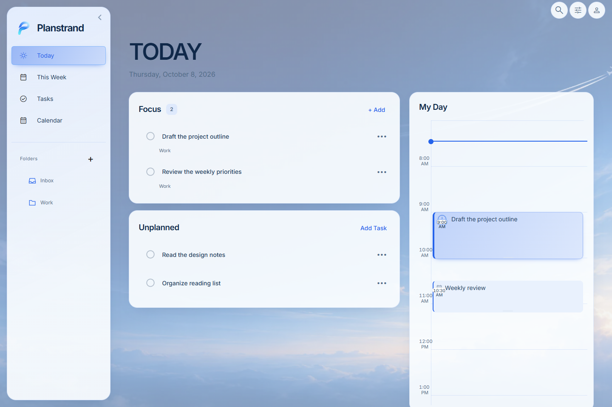
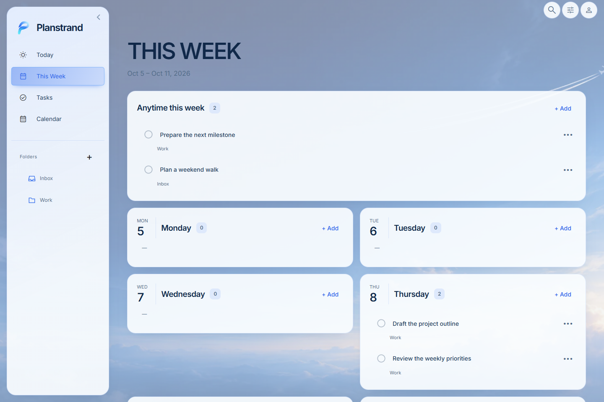
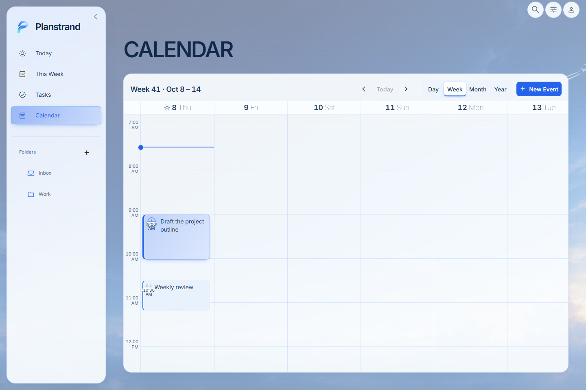
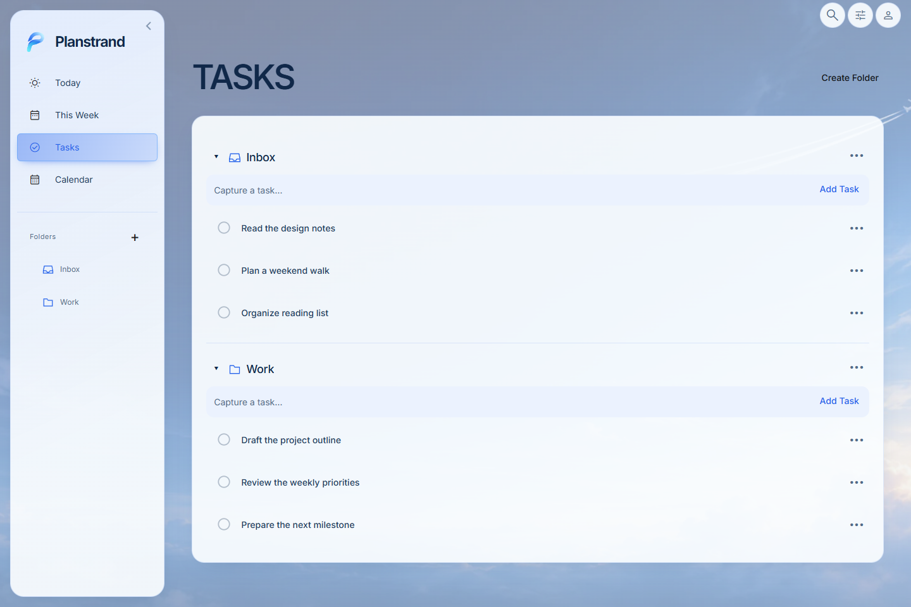

<p align="center">
  
</p>

<h1 align="center">Planstrand</h1>

<p align="center"><strong>Plan your time. Stay focused.</strong></p>

Planstrand is a local-first personal planner that brings tasks, weekly planning,
time blocking, and calendars together in one focused workspace. Work offline,
keep your data on your computer, and make room for what matters—no account required.



## Download

**Planstrand V1.1 RC1** · Windows x64 · [Release notes](https://github.com/hychaw/planstrand/releases/tag/v1.1.0-rc.1)

| Download                                                                                                       | Choose this for                                           |
| -------------------------------------------------------------------------------------------------------------- | --------------------------------------------------------- |
| [Windows Setup](https://github.com/hychaw/planstrand/releases/download/v1.1.0-rc.1/Planstrand-Setup.exe)       | Regular Windows installation; recommended for most users. |
| [Windows Portable](https://github.com/hychaw/planstrand/releases/download/v1.1.0-rc.1/Planstrand-Portable.exe) | Running without traditional installation.                 |

Both normally store user data separately from the executable, in the same default
Planstrand profile. The portable executable does not automatically carry your data
between computers.

Windows x64 is the currently validated distribution platform. These are **unsigned
release-candidate builds**: Windows SmartScreen or organizational security policies
may warn about or block execution. Keep a backup before upgrading between candidates.
See the release notes for validation details and known limitations.

[All releases](https://github.com/hychaw/planstrand/releases)

## A workspace for your plans

- **Tasks and Folders.** Capture Tasks in Inbox, organize them in hierarchical
  Folders you create, and complete work at your own pace.
- **Today and This Week.** Focus on today's Tasks, plan work for specific weekdays,
  or keep it in Anytime This Week. Planning stays independent of calendar time blocking.
- **Calendar and WorkSessions.** Explore Day, Week, Month, and Year views. Schedule
  multiple independent WorkSessions for a Task, move or resize each session, and
  complete it without completing its parent Task. Add standalone calendar Events.
- **Local-first and offline.** Core planning works offline and stores data locally
  by default. Optional synchronization uses providers and services you explicitly configure.
- **Make it yours.** Blue Thread brings a distinctive blue identity, light and dark
  appearance, Comfortable and Compact density, and a responsive desktop interface.

| This Week · weekly planning                                                                | Calendar · WorkSessions and Events                                                              |
| ------------------------------------------------------------------------------------------ | ----------------------------------------------------------------------------------------------- |
|  |  |

<details>
<summary>Tasks and Folders</summary>



</details>

## Get started

1. Download Planstrand Setup or Portable.
2. Launch the application.
3. Create Tasks in Inbox or Folders.
4. Plan work in Today or This Week.
5. Reserve focused time through WorkSessions in My Day or Calendar.

## Local data and privacy

On Windows desktop, the default user-data directory is `%APPDATA%\Planstrand`.
Tasks, Folders, Planning, Events, WorkSessions, and application preferences are
stored locally. Setup and Portable normally use this same profile.

Keep an independent backup through **Settings → Sync & Backup** before deleting
the profile or upgrading between release candidates. Deleting the entire profile
is different from a selective Task reset: it may remove Events, Settings, and
other local information too.

Core functionality requires no account. Explicitly configured synchronization or
integrations can send data to the remote services you choose. Planstrand does not
provide a public sync service; live multi-device synchronization has not been
comprehensively certified for this release.

## Development

Use **Node.js 22.18.0** and **npm 11.18.0**, as pinned in the repository.

```sh
npm ci
npm run startFrontend
```

In a separate terminal, launch Electron:

```sh
npm start
```

The frontend copies both project license notices as assets. Production frontend
scripts also generate and publish `3rdpartylicenses.txt` for the About page;
a fresh development-only startup does not generate that dependency notice file.
See [development guidance](docs/development.md) for repository conventions and checks.

## License and Acknowledgements

Planstrand is developed and maintained by **How Yee Chaw** and distributed under
the [MIT License](LICENSE). Original Planstrand contributions are copyright
(c) 2026 How Yee Chaw.

Planstrand is an independent fork of [Super Productivity](https://github.com/super-productivity/super-productivity),
originally developed by Johannes Millan and contributors. Inherited upstream code
retains its original copyright and [MIT license](LICENSES/SUPER_PRODUCTIVITY_MIT.txt);
third-party notices remain applicable. Planstrand is not officially affiliated
with or endorsed by Super Productivity.
